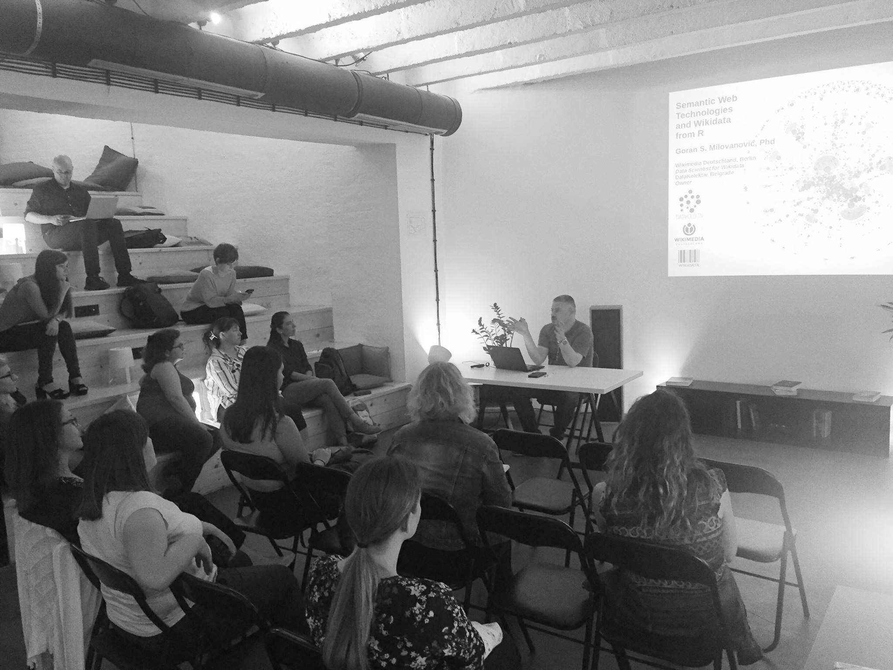
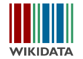

# R-Ladies_Belgrade_20190911: Semantic Web Technologies and Wikidata from R
R-Ladies Belgrade Meetup, September 11, 2019. Startit Center, Belgrade.

1. Learn how to access Wikidata from R: the {WikidataR} package.
2. Learn how to access Wikidata from R: the Wikidata MediaWiki API.
3. Learn how to access Wikidata from R: SPARQL (not a SPARQL course, of course, introductory examples only).
4. Learn how to process the full Wikidata JSON dump on your local machine from R.

Contents: R Markdown (.Rmd, rendered .html) + slide deck for the R-Ladies Belgrade Meetup, September 11, 2019.

